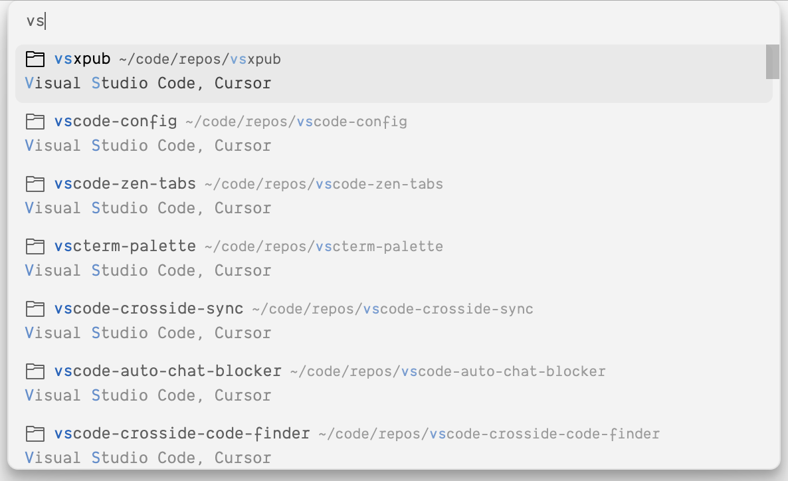
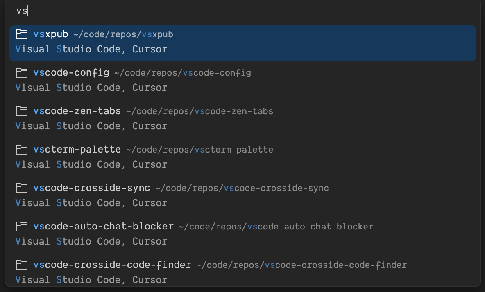

# VSCode Crosside Code Finder

A VS Code extension for cross-IDE recent project management. View and open recently accessed projects across multiple IDEs (Visual Studio Code, Cursor, Windsurf) in one unified interface. Automatically detect and manage code repositories in your configured workspace path, with support for git branch display and flexible configuration options.

<samp>Preview</samp>

  
  

> [!IMPORTANT]
> This extension requires **Node.js** to be installed on your system. Please install it from [nodejs.org](https://nodejs.org/) before using this extension.

> [!TIP]
> On Windows, enabling `showGitBranch` may slow down the query performance. You can disable it in the settings if needed.

## Configuration

<!-- configs -->

| Key                                        | Description                                                             | Type      | Default                                      |
| ------------------------------------------ | ----------------------------------------------------------------------- | --------- | -------------------------------------------- |
| `crosside-code-finder.ide`                 | The IDEs to read and update the open recent history.                    | `array`   | `["Visual Studio Code","Cursor","Windsurf"]` |
| `crosside-code-finder.workspace`           | The workspace to detect codespaces.                                     | `string`  | ``                                           |
| `crosside-code-finder.ignorePaths`         | The paths to ignore in the detection of codespaces.                     | `array`   | `[]`                                         |
| `crosside-code-finder.showGitBranch`       | Whether to show git branch in the open recent history.                  | `boolean` | `true`                                       |
| `crosside-code-finder.showSource`          | Whether to show source in the open recent history.                      | `boolean` | `true`                                       |
| `crosside-code-finder.openInNewWindow`     | Whether to open in a new window.                                        | `boolean` | `true`                                       |
| `crosside-code-finder.overwriteOpenRecent` | Whether to overwrite the open recent history when detecting codespaces. | `boolean` | `false`                                      |

<!-- configs -->

## Commands

<!-- commands -->

| Command                                             | Title                                      |
| --------------------------------------------------- | ------------------------------------------ |
| `octohash.crosside-code-finder.openRecent`          | Crosside Code Finder: Open Recent...       |
| `octohash.crosside-code-finder.detectCodespaces`    | Crosside Code Finder: Detect Codespaces    |
| `octohash.crosside-code-finder.installDependencies` | Crosside Code Finder: Install Dependencies |

<!-- commands -->

## License

[MIT](./LICENSE) License © [jinghaihan](https://github.com/jinghaihan)
